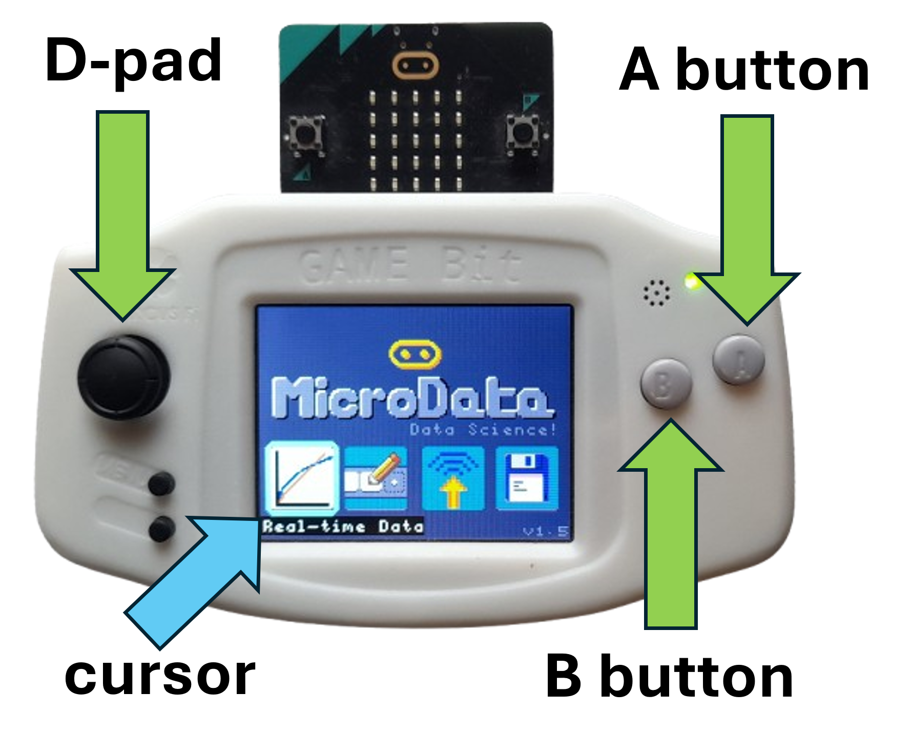

## Working with the display shield

Once you have downloaded the app to your micro:bit, plug it into the display shield.
See below for how the micro:bit slots into the shield.

Most display shields have a built-in battery. Turn on the power switch on the display 
shield to power both the shield and the micro:bit.

You can also power the micro:bit and shield directly via USB plugged into the micro:bit
or the display shield.

## User interface 

The display shields have a 4-way directional pad (D-pad) or 4 buttons
arrange in a diamond, to the left of the screen.  To the right of 
the screen are the A and B buttons.  The D-pad is used to move 
the cursor in the UI up/down/left/right. The A button is used to
select the current element the cursor is on. The B button is used
to back out of a screen or dialog.

