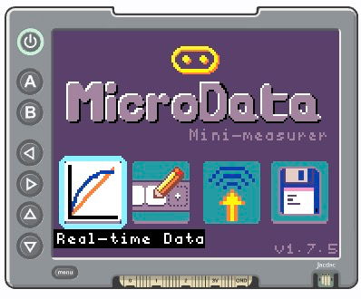
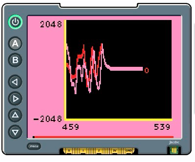

<CardGrid>
  <Card title="MicroData Home Page">
    
  </Card>
  <Card title="MicroData Live View">
    
  </Card>
</CardGrid>

MicroData is a comprehensive data collection and analysis platform designed for the BBC micro:bit.

## What is MicroData?

MicroData provides tools for collecting, visualizing, and analyzing sensor data from your micro:bit with:

- Real-time data streaming and visualization
- Multi-sensor support
- Data analysis capabilities

## Getting Started

- [Open MicroData](https://makecode.microbit.org/beta/#pub:95125-24885-94306-07135) in
a web browser. 
- Explore MicroData via the simulator. Click on the full-screen icon in the simulator to 
  get the best experience.
- Download the code to your micro:bit by clicking the "Download" button in the MakeCode editor
and following instructions on how to copy MicroData onto your micro:bit.
- Insert your micro:bit, programmed with MicroCode, into a [display shield](/getting-started/display-shields)

## Learn More

- [Official Documentation](https://github.com/microbit-apps/microdata)
- [GitHub Repository](https://github.com/microbit-apps/microdata)

import { Card, CardGrid, LinkCard } from '@astrojs/starlight/components';
