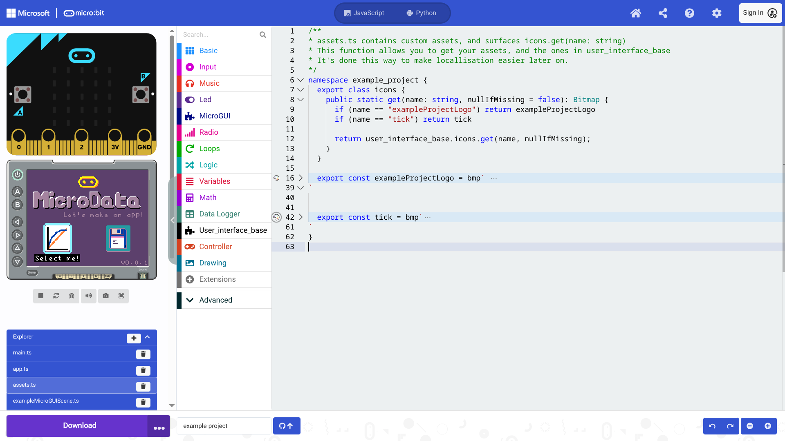
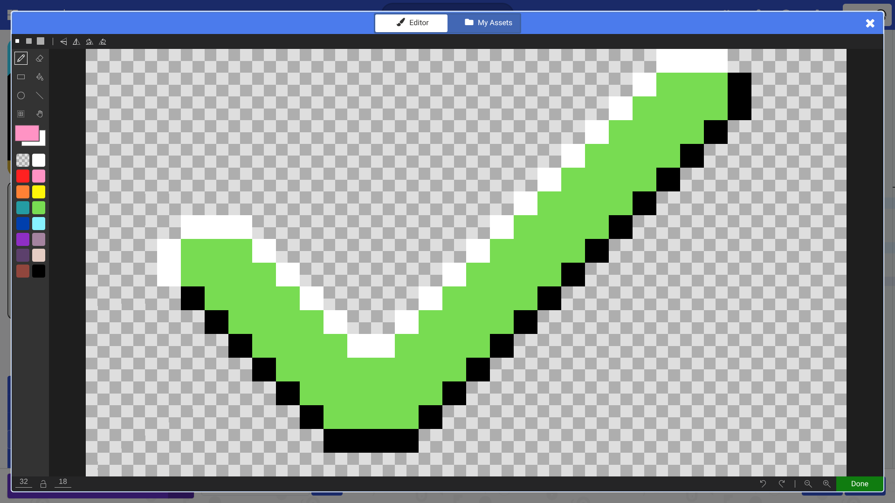
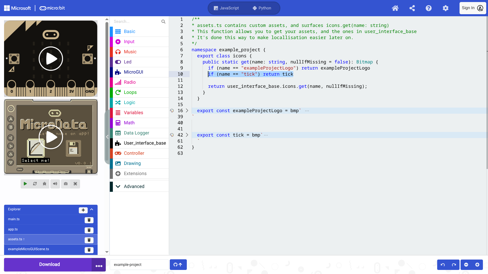

This section explains the architecture of a micro:bit app starting with an overview.
This is followed by a walkthrough of the code found at [microbit-apps/example](https://github.com/microbit-apps/example).

## App structure overview
There are four key parts a micro:bit app:
- **user-interface-base** is an extension used by all micro:bit apps, it gives you control of the display in STS, common assets, and high level GUI components like Scenes and buttons. 
- **app.ts** is the entry point of your app, it is started in main.ts.
- **pxt.json** is where the name of app, its dependencies (extensions like user-interface-base) and the files (like app.ts) are declared.
- **your scenes** make up a micro:bit app. Each scene is a group of graphical primitives. Typically there is one scene per file.


### Scene vs CursorScene
A microbit-apps is a collection of scenes. As you will soon see we write our own scenes by **extending** from either **Scene** or **CursorScene**.
These are parent classes that handle common behaviour for you.

A CursorScene is for handling displaying and selecting buttons, it sets up the
contoller to navigate over graphical buttons for you. **home.ts** is an example of a CursorScene.

If you want your own control over the controller's buttons, or your scene doesn't use graphical buttons,
then you should probably don't need to use the **CursorScene**.

## Development
When the micro:bit is powered on the code in main.ts is executed.
This file normally contains just one line which constructs the App().

**main.ts**:

```
new example_project.App()
```

**app.ts**:

It is convention to wrap your code in a namespace with the same name as your project (dashes are not permitted).

The App class owns a SceneManager. This SceneManager is a stack of scenes where the top-most scene is drawn onto the display.
It is unlikely that you will need to change this code.

The main thing to focus on in this code is that we push the Home scene onto the stack, which is defined in **home.ts** and included in **pxt.json**.

```
namespace example_project {
  import AppInterface = user_interface_base.AppInterface
  import Scene = user_interface_base.Scene
  import SceneManager = user_interface_base.SceneManager

  // application configuration:
  user_interface_base.getIcon = (id: string) => icons.get(id)
  user_interface_base.resolveTooltip = (ariaId: string) => ariaId

  export class App implements AppInterface {
    sceneManager: SceneManager

    constructor() {
      // One interval delay to ensure all static constructors have executed.
      basic.pause(5)

      this.sceneManager = new SceneManager()

      this.pushScene(new example_project.Home(this));
    }

    public pushScene(scene: Scene) {
      this.sceneManager.pushScene(scene)
    }

    public popScene() {
      this.sceneManager.popScene()
    }

    // Stub to satisfy AppInterface. You can implement as needed:
    public save(slot: string, buffer: Buffer): boolean {
      return true;
    }

    // Stub to satisfy AppInterface. You can implement as needed:
    public load(slot: string): Buffer {
      return Buffer.create(0)
    }
  }
}
```

**exampleScene.ts**

This is a simple scene that prints some text on the screen and binds the controllers A/Select and B/Back buttons.

```
namespace example_project {
  import Screen = user_interface_base.Screen
  import Scene = user_interface_base.Scene
  import AppInterface = user_interface_base.AppInterface
  import font = user_interface_base.font

  /**
  * Use a Scene instead of a CursorScene when you want to
  * control display-shield button behaviour yourself.
  */
  export class ExampleScene extends Scene {
    constructor(app: AppInterface) {
      super(app)
    }

    startup() {
      // Setup display-shield buttons yourself
      control.onEvent(
        ControllerButtonEvent.Pressed,
        controller.A.id,
        () => {
          this.app.pushScene(new ExampleMicroGUIScene(this.app))
        }
      )

      control.onEvent(
        ControllerButtonEvent.Pressed,
        controller.B.id,
        () => {
          this.app.popScene()
        }
      )
    }

    draw() {
      Screen.fillRect(
        Screen.LEFT_EDGE,
        Screen.TOP_EDGE,
        Screen.WIDTH,
        Screen.HEIGHT,
        6 // Light blue in the default palette
      )

      const txt1 = "Press A for the next scene"
      Screen.print(
        txt1,
        -txt1.length * font.charWidth >> 1,
        -20,
        15 // Black in the default palette
      )

      const txt2 = "Press B to go back"
      Screen.print(
        txt2,
        -txt2.length * font.charWidth >> 1,
        20,
        15 // Black in the default palette
      )

      super.draw()
    }
  }
}
```


**simpleCursorScene.ts**:

```
namespace example_project {
  import Screen = user_interface_base.Screen
  import CursorScene = user_interface_base.CursorScene
  import Button = user_interface_base.Button
  import ButtonStyles = user_interface_base.ButtonStyles
  import AppInterface = user_interface_base.AppInterface

  export class SimpleCursorScene extends CursorScene {
    constructor(app: AppInterface) {
      super(app)
    }

    /* override */
    startup() {
      super.startup()

      // "accelerometer" is the name of a bitmap fetched from user_interface_base.coreAssets
      // This is explored further later on
      this.navigator.setBtns([[
        new Button({
          parent: null,
          style: ButtonStyles.Transparent,
          icon: "accelerometer",
          ariaId: "Enter ExampleScene",
          x: 0,
          y: 0,
          onClick: () => {
            this.app.pushScene(new ExampleScene(this.app))
          },
        })
      ]])
    }

    activate() {
      super.activate();
      control.onEvent(
        ControllerButtonEvent.Pressed,
        controller.B.id,
        () => {
          this.app.popScene()
        }
      )
    }

    draw() {
      Screen.fillRect(
        Screen.LEFT_EDGE,
        Screen.TOP_EDGE,
        Screen.WIDTH,
        Screen.HEIGHT,
        12 // purple in default palette
      )

      this.navigator.drawComponents();
      super.draw()
    }
  }
}
```

**home.ts**:

This is what you see on the screen when you first turn on the app.

```
this.pushScene(new example_project.Home(this));
```

This is an example of a more complex CursorScene, it features graphical code to make the app title scroll down and bounce,
it is setup the same as the SimpleCursorScene though.

```
namespace example_project {
  import Screen = user_interface_base.Screen
  import CursorScene = user_interface_base.CursorScene
  import Button = user_interface_base.Button
  import ButtonStyles = user_interface_base.ButtonStyles
  import AppInterface = user_interface_base.AppInterface
  import font = user_interface_base.font

  export class Home extends CursorScene {
    /** Used by draw for examplelogo visual effect **/
    private yOffset = -Screen.HEIGHT >> 1

    constructor(app: AppInterface) {
      super(app)
    }

    /* override */
    startup() {
      super.startup()
      this.navigator.setBtns([[
        new Button({
          parent: null,
          style: ButtonStyles.Transparent,
          icon: "linear_graph_1",
          ariaId: "Select me!",
          x: -40,
          y: 25,
          onClick: () => {
            this.app.pushScene(new ExampleScene(this.app))
          },
        }),
        new Button({
          parent: null,
          style: ButtonStyles.Transparent,
          icon: "largeDisk",
          ariaId: "Or select me!",
          x: 40,
          y: 25,
          onClick: () => {
            this.app.pushScene(new ExampleMicroGUIScene(this.app))
          },
        })
      ]])
    }

    private drawVersion() {
      const font = bitmaps.font5
      const text = "v0.0.1"
      Screen.print(
        text,
        Screen.RIGHT_EDGE - (font.charWidth * text.length),
        Screen.BOTTOM_EDGE - font.charHeight - 2,
        11, // light grey in the default palette
        font
      )
    }

    draw() {
      Screen.fillRect(
        Screen.LEFT_EDGE,
        Screen.TOP_EDGE,
        Screen.WIDTH,
        Screen.HEIGHT,
        12 // purple in default palette
      )

      // How we can get bitmaps from assets, which we then draw to the screen:
      const microbitLogo = icons.get("microbitLogo")
      const microdataLogo = icons.get("exampleProjectLogo")

      // This code makes the microdataLogo scroll down from the screen and bounce.
      // You can ignore the specifics of this code:
      this.yOffset = Math.min(0, this.yOffset + 2)
      const t = control.millis()
      const dy = this.yOffset == 0 ? (Math.idiv(t, 800) & 1) - 1 : 0
      const margin = 2
      const OFFSET = (Screen.HEIGHT >> 1) - microdataLogo.height - margin - 9
      const y = Screen.TOP_EDGE + OFFSET

      Screen.drawTransparentImage(
        microdataLogo,
        Screen.LEFT_EDGE + ((Screen.WIDTH - microdataLogo.width) >> 1),
        y + this.yOffset
      )

      Screen.drawTransparentImage(
        microbitLogo,
        Screen.LEFT_EDGE + ((Screen.WIDTH - microbitLogo.width) >> 1),
        y - microdataLogo.height + this.yOffset + margin
      )

      if (!this.yOffset) {
        const flavourText = "Let's make an app!"
        const x = Screen.LEFT_EDGE + ((Screen.WIDTH + microdataLogo.width) >> 1) + dy
                  - (flavourText.length * font.charWidth)
        const y = Screen.TOP_EDGE + OFFSET + microdataLogo.height + dy + this.yOffset + 3
        Screen.print(
          flavourText,
          x,
          y,
          11, // light grey in the default palette
          font
        )
      }

      this.navigator.drawComponents();
      this.drawVersion()
      super.draw()
    }
  }
}
```

## Assets
**assets.ts** allows you to make your own bitmaps, which are images that you can use in your app. The library
user-interface-base has lots of default assets, but you can create your own easily by pressing the palette button:

<Card title="1: Select the palette button next to the line number">
  
</Card>
<Card title="2: Draw your own asset!">
  
</Card>
<Card title="3: Add your new asset to the icons.get function">
  
</Card>


### Using bitmaps

**For a button:**
```
    // See the icon field:
    const myBtn = new Button({
      parent: null,
      style: ButtonStyles.Transparent,
      icon: "linear_graph_1", // <---- my asset
      ariaId: "Select me!",
      x: -40,
      y: 25,
      onClick: () => {
        this.app.pushScene(new ExampleScene(this.app))
      },
    })
```

**Drawing a bitmap:**

drawTransparentImage will replace any pixels that are colour-less '.' with the background colour.

```
  const microbitLogo = icons.get("microbitLogo")
  Screen.drawTransparentImage(
    microbitLogo,
    Screen.LEFT_EDGE + ((Screen.WIDTH - microbitLogo.width) >> 1),
    Screen.TOP_EDGE + ((Screen.HEIGHT - microbitLogo.height) >> 1)
  )
```

import { Card, CardGrid, LinkCard } from '@astrojs/starlight/components';
