This section will guide you through setting up your development environment and getting started with programming your own micro:bit app.

### MakeCode setup
<Card title="1: Open the MakeCode editor">
  Go to https://makecode.microbit.org/
  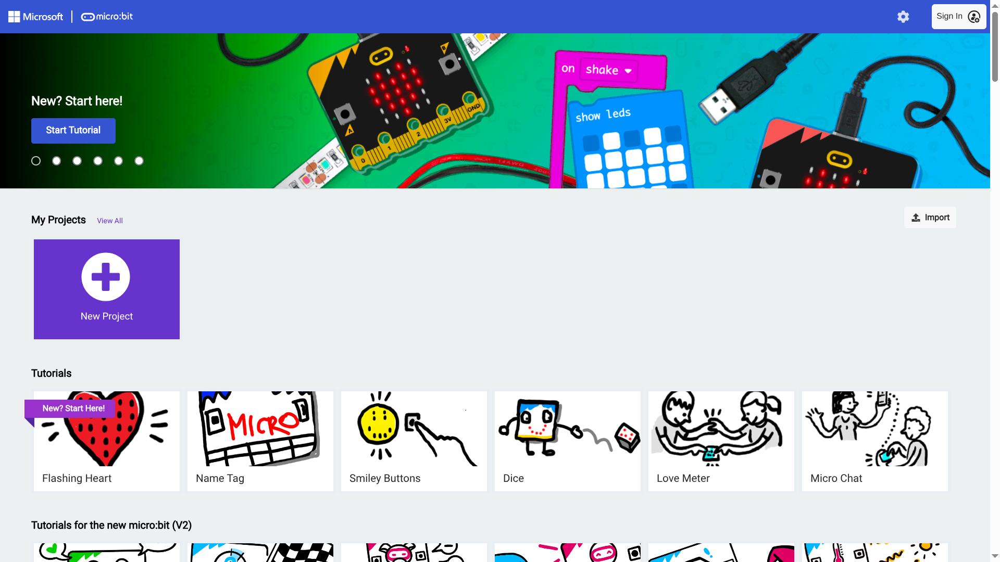
</Card>
<Card title="2: Click 'Import' on the middle-right of the screen">
  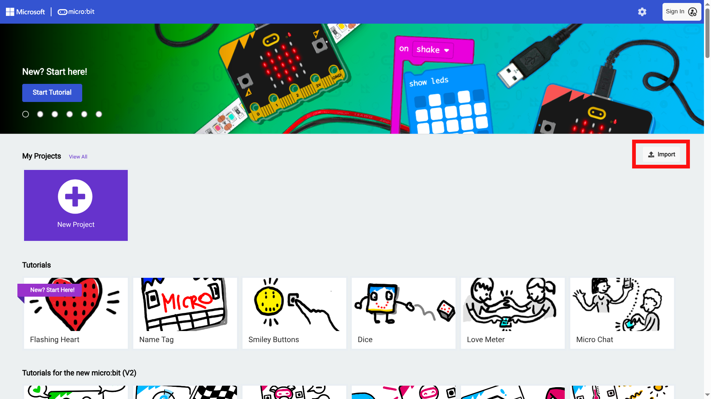
</Card>
<Card title="3: Click 'Import URL...'">
  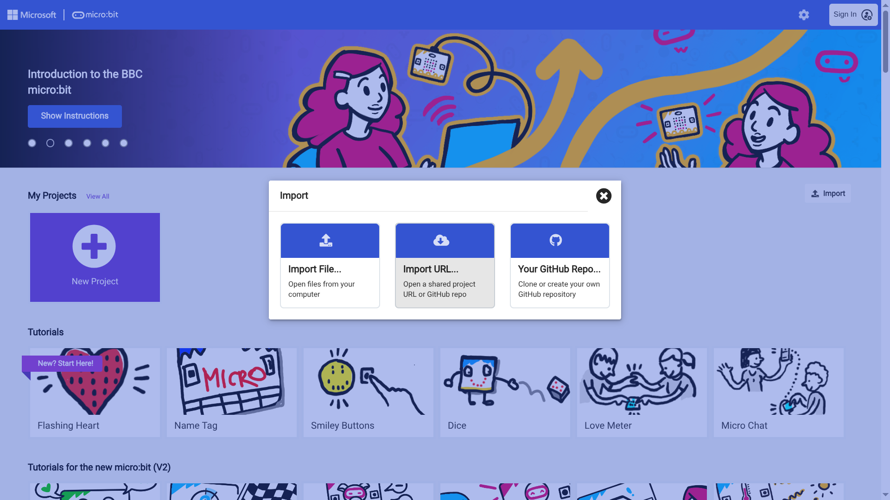
</Card>
<Card title="4: Import the example app">
  Paste https://github.com/microbit-apps/example or your own fork of it
  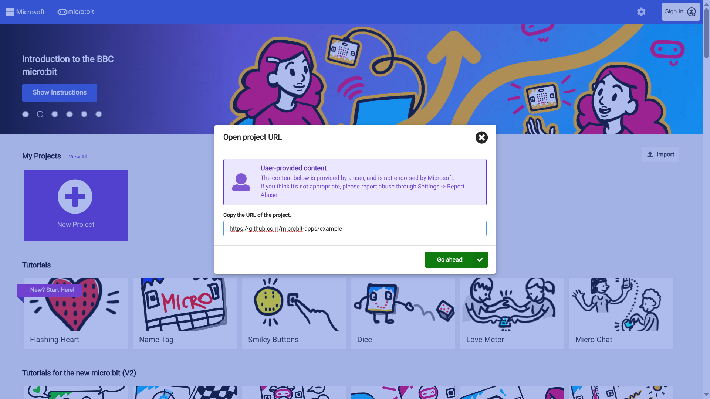
</Card>
<Card title="5: Start programming your app!">
  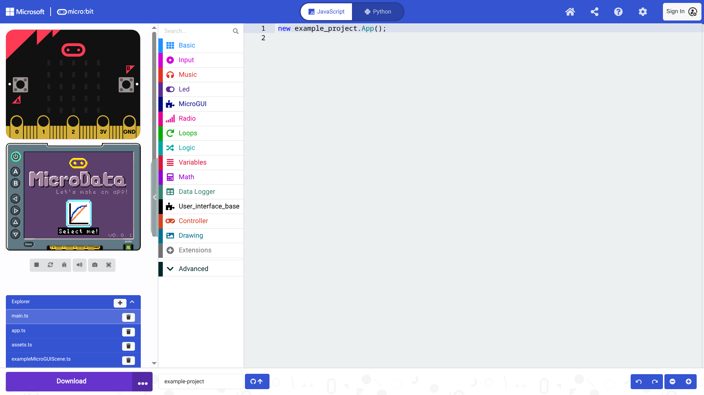
</Card>
<Card title="6: Click file names on the bottom-left">
  app.ts is a good starting point. On line 24 it pushes the home scene (see home.ts) onto the scene stack.
  This scene is what you see on the screen.
  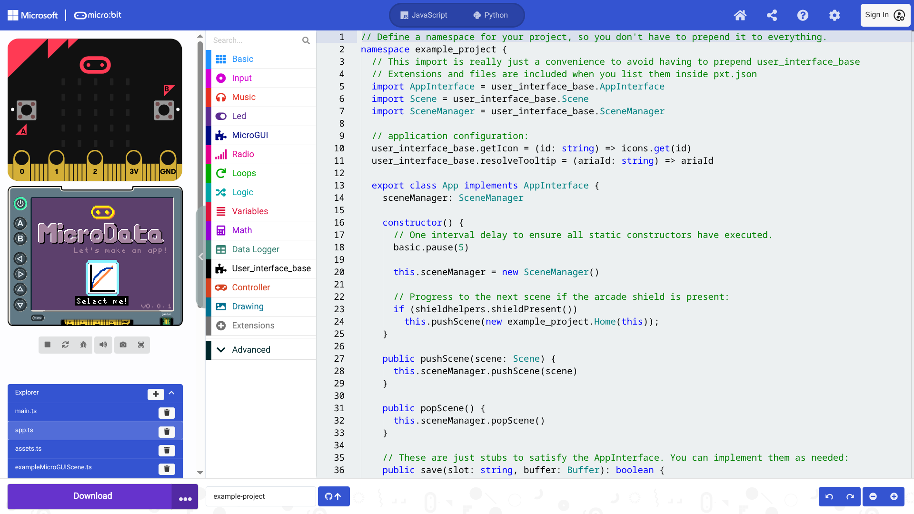
</Card>
<Card title="7: Click pxt.json, then 'Edit settings As text' to view dependencies">
  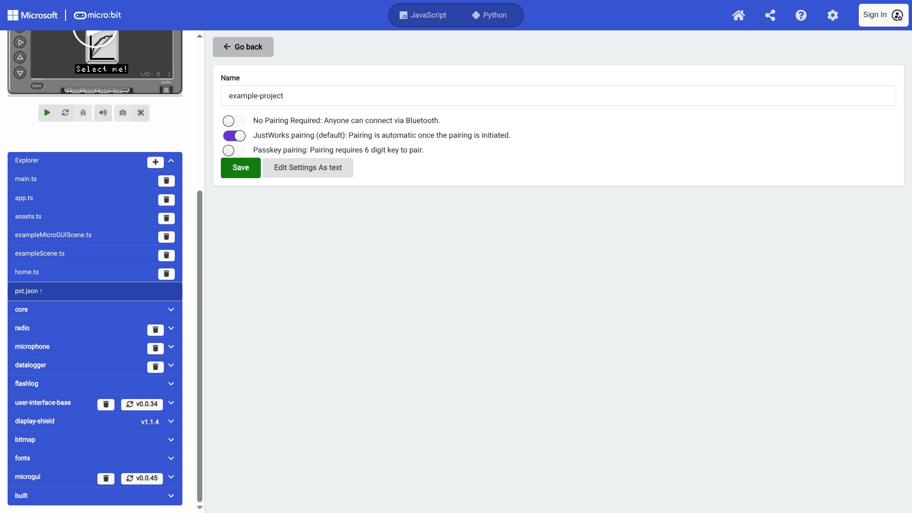
</Card>
<Card title="8: Managing dependencies and files">
  If you create a new file or want to add an extension you do so here.
  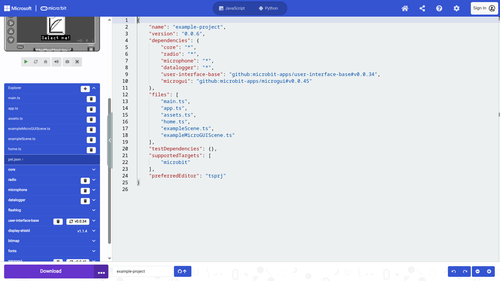
</Card>

#### Github integration
MakeCode has built in github integration, allowing you to easily share your work and collaborate with others.
MakeCode saves your work as a project, so this isn't required for initial development and experimentation.

We recommend using this feature if you've forked [github.com/microbit-apps/example](https://github.com/microbit-apps/example) though

<Card title="Press the Github button in the middle-bottom">
  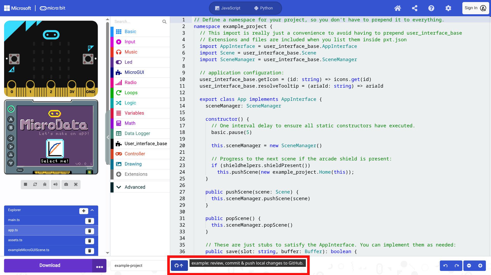
</Card>
<Card title="Here you can pull, commit and push changes to your fork">
  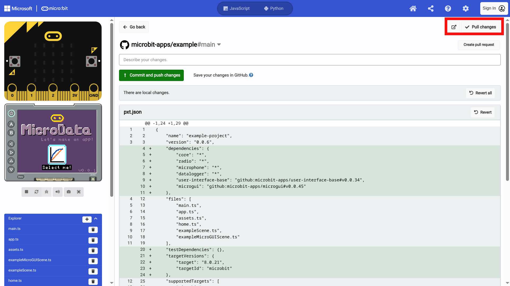
</Card>


### VSCode setup
Development in VSCode is also supported with our simulator. VSCode requires more setup, but is a more feature rich environment.

<Card title="1: Install VSCode">
  Go to https://code.visualstudio.com/Download
  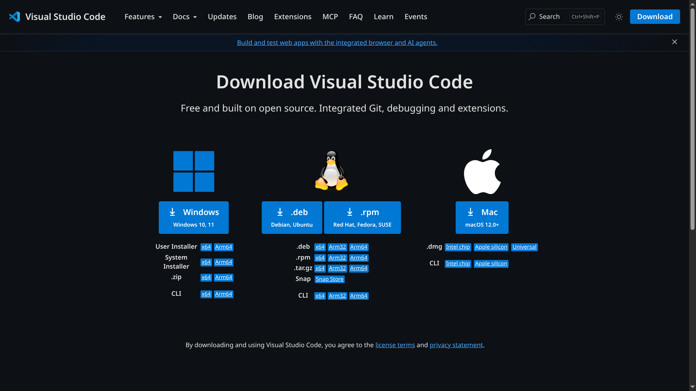
</Card>
<Card title="2: Installing Node: NVM">
  We need Node for the Static TypeScript compiler and package management.
  To get node we first need nvm (Node Version Manager), which allows you to easily install and manage multiple versions of node on your machine.
  Go to https://www.nvmnode.com/guide/download.html
  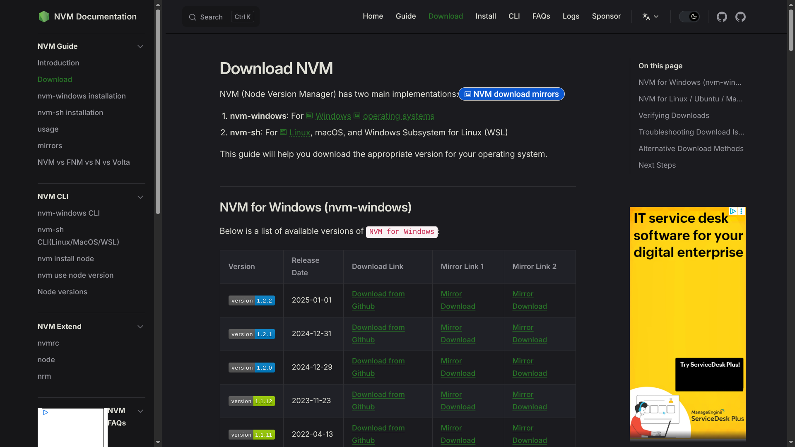
</Card>
<Card title="3: Installing Node: NPM">
  Now that we have the node version manager, we can install the node package manager (npm).
  Type the following into your terminal:

  ```nvm install 24```

  ```nvm use 24```
</Card>
<Card title="3: Install the makecode-cli">
  Now that we have node setup we can get the [makecode-cli npm package](https://www.npmjs.com/package/makecode)

  Install makecode globally:

  ```npm i -g makecode```

  Test that it's available. Note that the package is called makecode, but the command is mkc:

  ```mkc --help```
</Card>


Coming soon:
using makecode-cli,
using VSCode simulator

import { Card, CardGrid, LinkCard } from '@astrojs/starlight/components';
