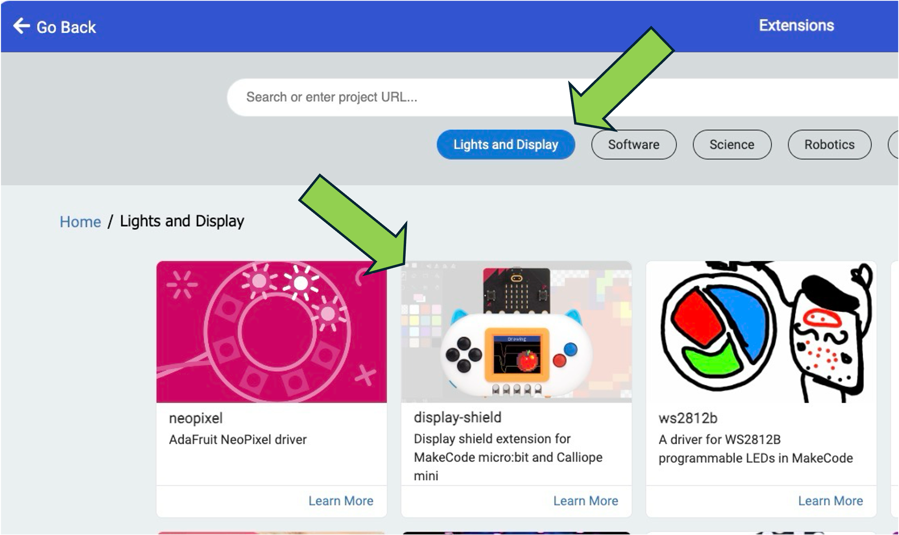

The [MakeCode display shield extension](https://makecode.microbit.org/pkg/microbit-apps/display-shield) allows you to use any of the MakeCode Arcade shields with the [MakeCode for the micro:bit](https://makecode.microbit.org) or [MakeCode for Calliope](https://makecode.calliope.cc/) editors.

## Features

- **simulator support**
- access to the color display and buttons on the shield
- Bitmap abstraction with numerous drawing primitives (draw line, circle, square, etc)
- Bitmaps also can be created using the built-in image editor in MakeCode

## Getting Started

- Open https://makecode.microbit.org/
- Create a new project
- Add an extension via the “Extensions” item in the gear wheel (upper right)
- Click the “Lights and Display” button, as shown below
- Select the display shield extension, as shown below



## Plot the accelerometer values as time series

Copy this program into the JavaScript editor to plot the
instantaneous values of the micro:bit's 3-axis accelerometer
on the display shield screen:

```javascript
let x = 0, old_x = 0
let y = 0, old_y = 0
let z = 0, old_z = 0
let t = 0
basic.forever(function () {
    x = Math.map(input.acceleration(Dimension.X), -1024, 1024, 120, 0)
    y = Math.map(input.acceleration(Dimension.Y), -1024, 1024, 120, 0)
    z = Math.map(input.acceleration(Dimension.Z), -1024, 1024, 120, 0)
    screen().drawLine(t, x, t - 1, old_x, 3)
    screen().drawLine(t, y, t - 1, old_y, 4)
    screen().drawLine(t, z, t - 1, old_z, 5)
    t = t + 1
    if (t == 160) {
        screen().scroll(-1, 0)
        t = 159
    }
    old_x = x
    old_y = y
    old_z = z
})
```

## Learn More

- [API reference and examples](https://makecode.microbit.org/pkg/microbit-apps/display-shield)
- [GitHub Repository](https://github.com/microbit-apps/display-shield)
