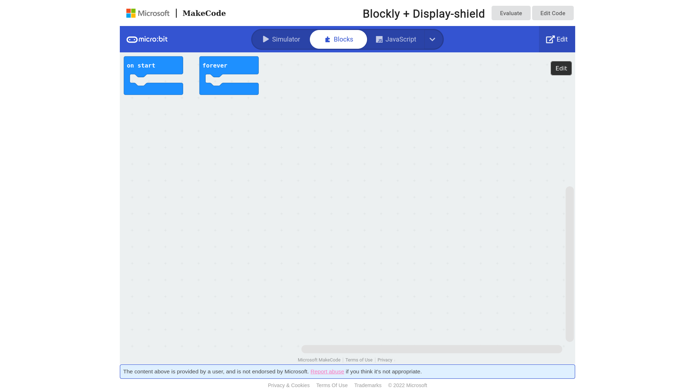
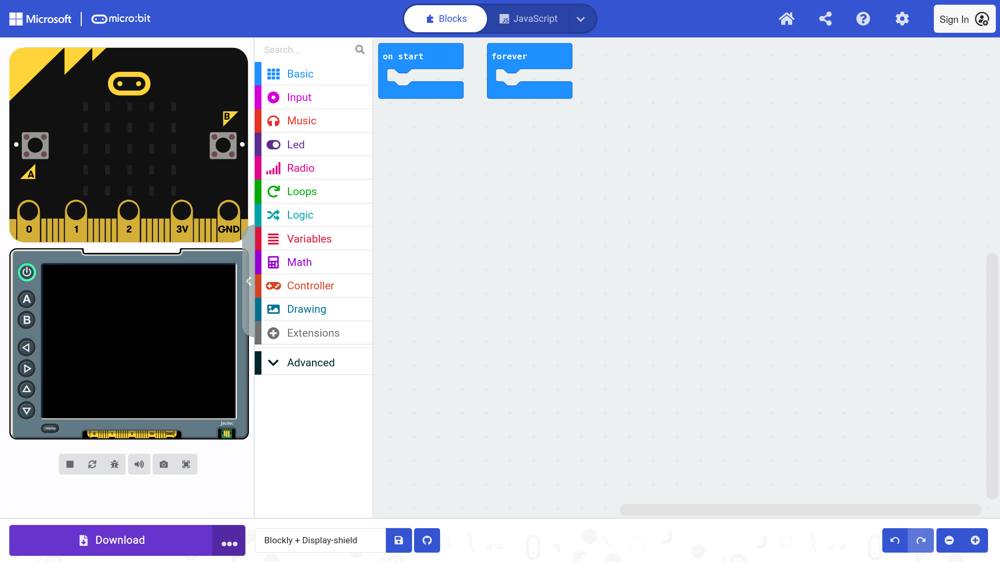
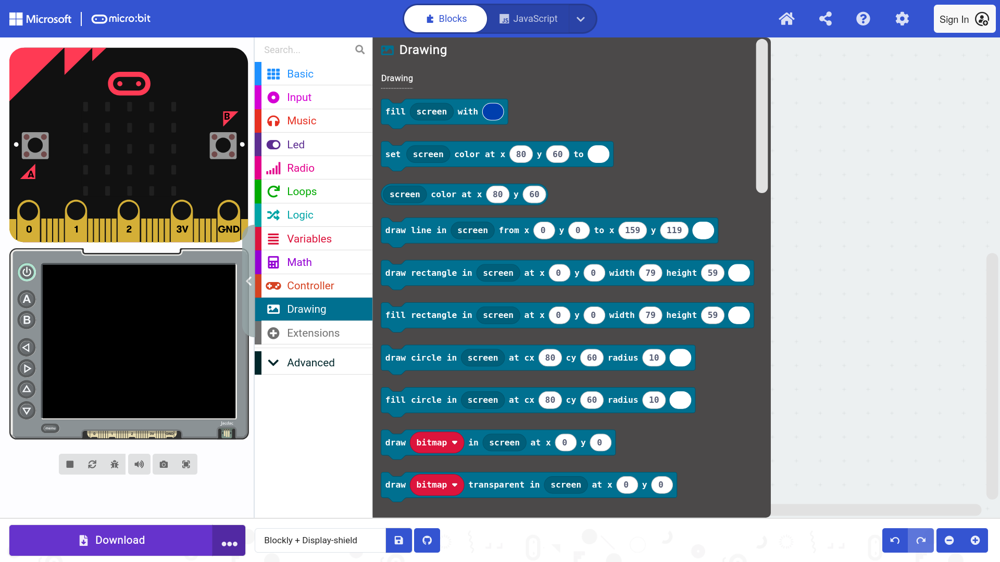
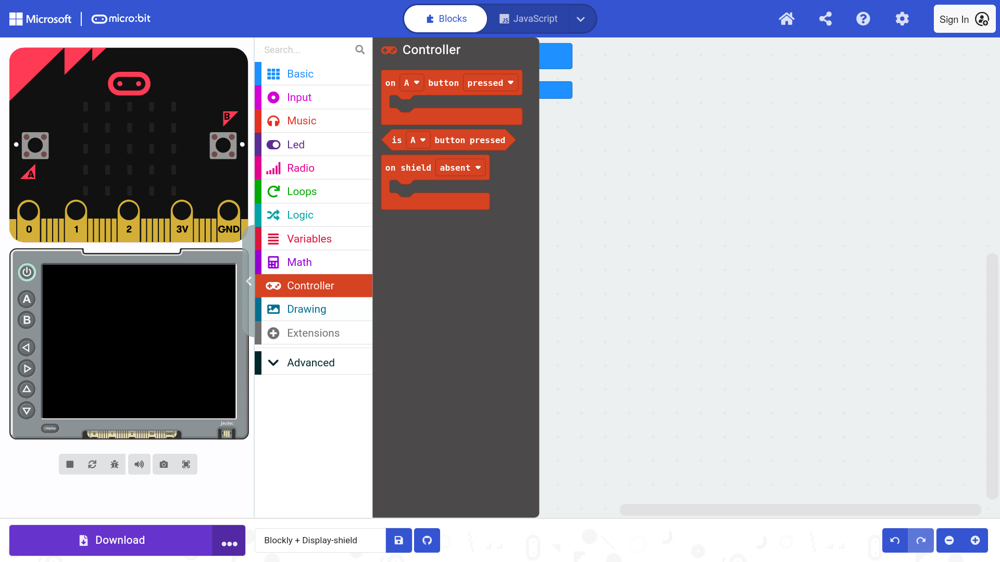

Below are three ways you can program a BBC micro:bit v2 to control a display shield.
Starting with the simplest, you can do:
- Block-based programming using the [display shield extension](/extensions/display-shield-ext/) in MakeCode
- Using [MakeCode Arcade](https://arcade.makecode.com/), a variant of MakeCode designed for retro-style games
- In just Static TypeScript (STS) or C++, such as the more complicated micro:bit-apps like [MicroCode](/microcode/start/) and [MicroData](/microdata/start/)

All of the above techniques have MakeCode simulator support, allowing you to test your micro:bit and display-shield code before flashing your code
onto the micro:bit.

## Block-based MakeCode Setup

<Card title="1. Get started with our MakeCode link">
  This project link starts MakeCode with the display-shield extension already loaded.
  [https://makecode.microbit.org/_U8iPw6AWCbfv](https://makecode.microbit.org/_U8iPw6AWCbfv)
</Card>
<Card title="2. Start editing">
  The link above will open a preview, click 'Edit' or 'Edit Code'
  
</Card>
<Card title="3. MakeCode & simulator startup">
  You should now see the MakeCode editor, with a micro:bit and display-shield simulator.
  
</Card>
<Card title="4. Use the Drawing toolbox to write to the display">
  
</Card>
<Card title="5. Use the Controller toolbox for the display-shield buttons">
  
</Card>

Get coding with MakeCode!

import { Card, CardGrid, LinkCard } from '@astrojs/starlight/components';
