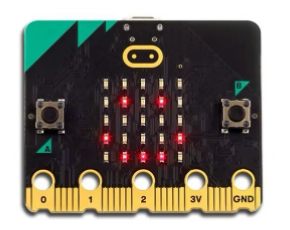

The [BBC micro:bit](https://microbit.org/) is a small, programmable microcomputer 
designed to help you learn how computers work. It's perfect 
for beginners and experienced programmers alike.

## Key Features

- **Compact Design**: Fits in the palm of your hand
- **Built-in Sensors**: accelerometer, magnetometer, temperature sensors, and more
- **LED Display**: 5×5 matrix of red LEDs for visual feedback
- **Wireless**: Connect with other micro:bits via radio
- **Educational**: Perfect for learning coding and electronics

## Explore the micro:bit with MakeCode

You can try out the micro:bit and its features before getting a physical device
via [Microsoft MakeCode](https://makecode.microbit.org/). The simulator allows you to
write code and see how it works on a virtual micro:bit.

## Get Your Micro:bit

Visit the [micro:bit website](https://microbit.org/buy/) to purchase 
and learn more about this amazing device.
