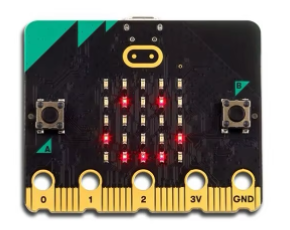
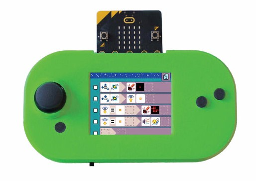
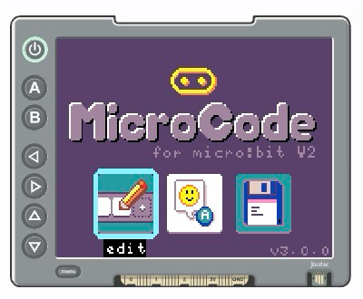
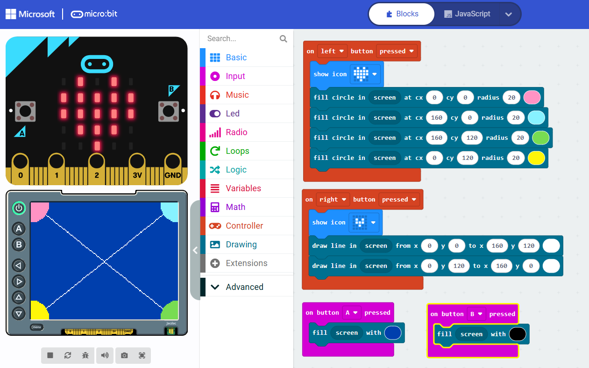

Explore engaging **micro:bit apps** designed to enhance learning and creativity. 
**micro:bit apps** run on the [BBC micro:bit](/getting-started/intro/) and make use of 
[display shields](/getting-started/display-shields/) for visual output and additional inputs.

<CardGrid>
  <Card title="The BBC micro:bit">
    
  </Card>
  <Card title="Display shields">
    
  </Card>
</CardGrid>

Please note that:
- **micro:bit apps** require micro:bit v2 and run on the micro:bit itself, using a display shield for visual output and additional inputs
- [mobile apps for the micro:bit](https://microbit.org/get-started/user-guide/mobile/) run on 
  mobile tablets/phones and communicate over Bluetooth to a micro:bit

## Featured apps

<CardGrid>
  <Card title="MicroCode" link="/microcode/start/">
    a visual programming environment for beginners 
    
  </Card>
  <Card title="MicroData" link="/microdata/start/">
    collect and visualize sensor data from your micro:bit 
    
  </Card>
</CardGrid>

## MakeCode extensions

<CardGrid>
  <Card title="Display Shield Extension" link="/extensions/display-shield-ext/">
    a MakeCode extension with simulator
    
  </Card>
</CardGrid>

## Get Involved

Join our community and contribute to the growing ecosystem of micro:bit applications. 
Visit our [github project](https://github.com/microbit-apps) to learn more and get involved!

import { Card, CardGrid, LinkCard } from '@astrojs/starlight/components';
