## Start afresh

Open the samples menu and select the empty program,
as shown below.

<CardGrid>
  <Card title="Select samples tile">
    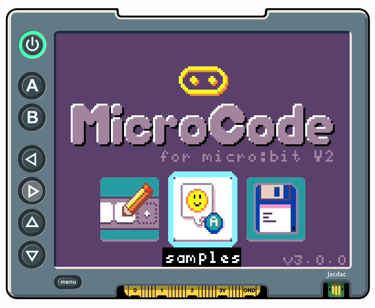
  </Card>
  <Card title="Select empty tile">
    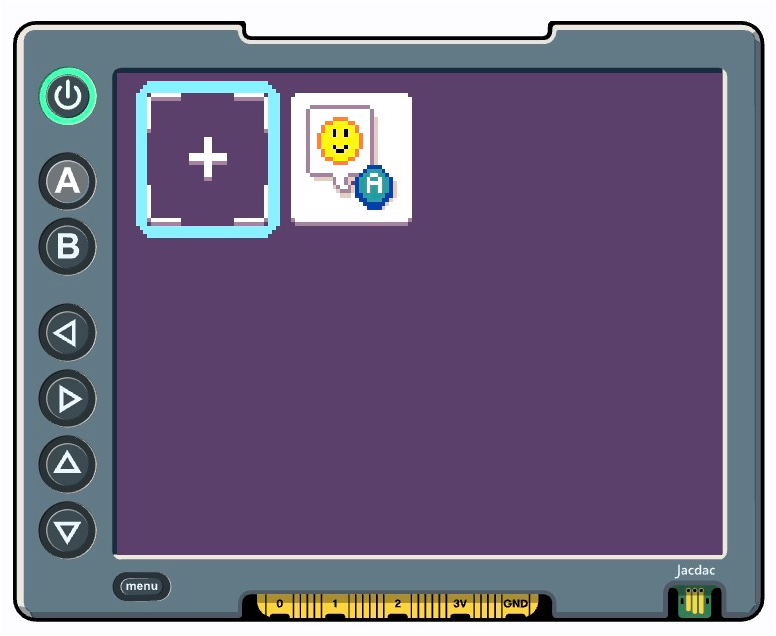
  </Card>
</CardGrid>

## Press `d-A` to create your first rule

The editor should be open on the empty program
with the cursor in the **When** section of the first
rule.  Press `d-A` to bring up the **When** menu, which 
lists the  various events to choose from. The `press` 
event tile is selected. Press `d-A` to insert
the press tile into the rule.

<CardGrid>
  <Card title="The empty program">
    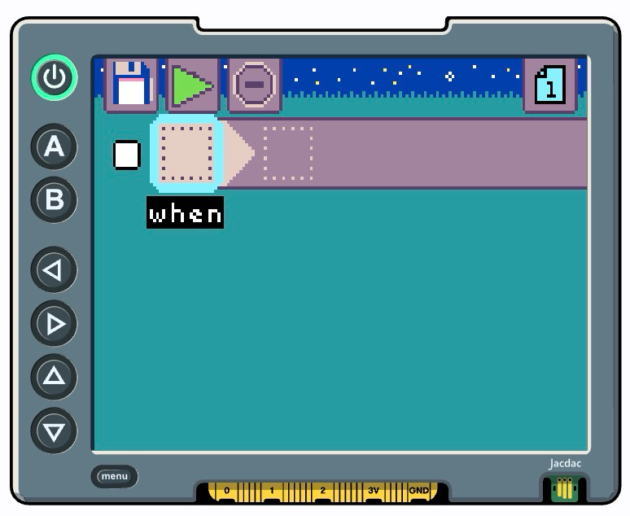
  </Card>
  <Card title="The When menu">
    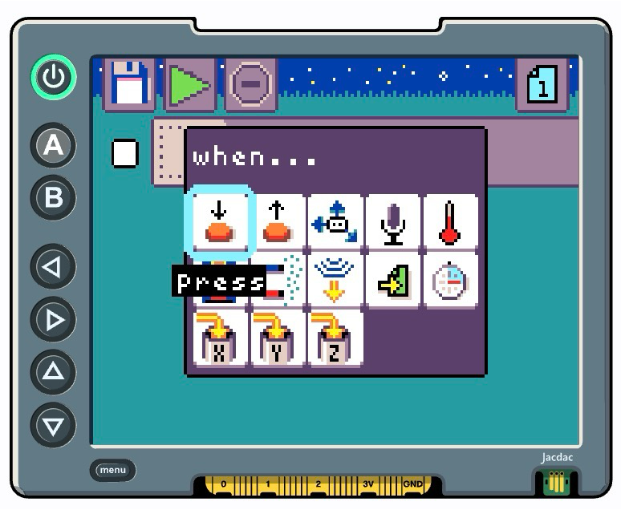
  </Card>
</CardGrid>

## Select the button to recognize

As shown below, the cursor should now be on the empty tile
to the right of the `press` tile. 

Press the `d-A` button again
to bring up the menu that lists the options
for which "pressable" items the micro:bit offers,
which includes the `m-A` and `m-B` buttons,
as well as the micro:bit logo and the three 
large pins (labelled 0, 1, and 2) on the 
micro:bit's edge connector.

Press `d-A` to select the `m-A` button. 

<CardGrid>
  <Card title="First tile created!">
    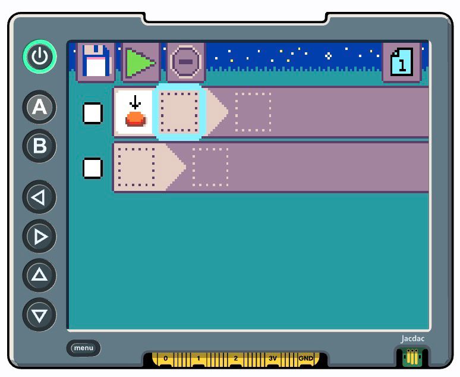
  </Card>
  <Card title="Pressable options">
    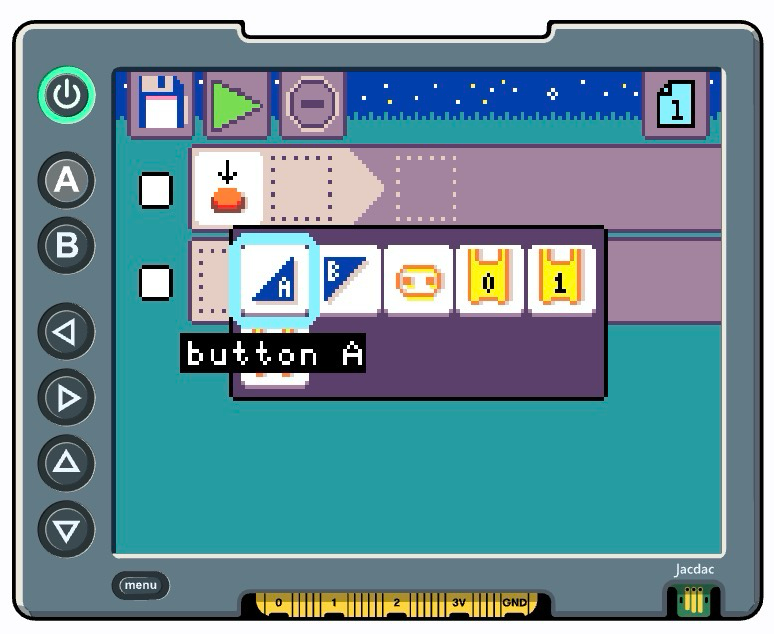
  </Card>
</CardGrid>

## When complete, move to Do!

Now that you have finished the **When** section of the rule,
the cursor now is in the **Do** section, as shown below.
Click the `d-A` button to bring up the menu of
actions to select from. The `show image` tile is selected 
by default. Press `d-A` again to insert the tile.

<CardGrid>
  <Card title="When section complete">
    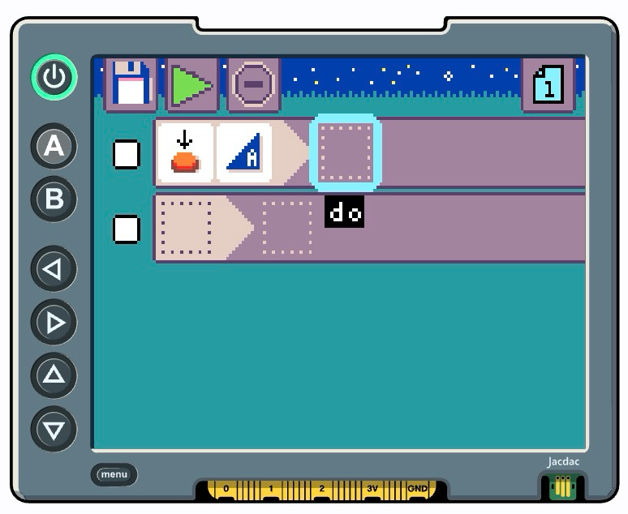
  </Card>
  <Card title="Do menu">
    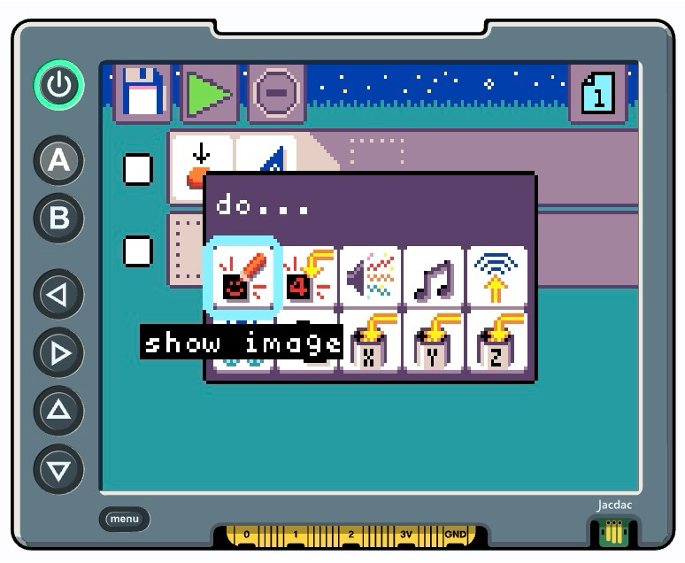
  </Card>
</CardGrid>

## Start your first image

Now, press `d-A` again to bring up a two-tile menu
with the image editor tile selected (the other tile
is the repeat tile). Press `d-A` to enter the image
editor.

<CardGrid>
  <Card title="Show image inserted">
    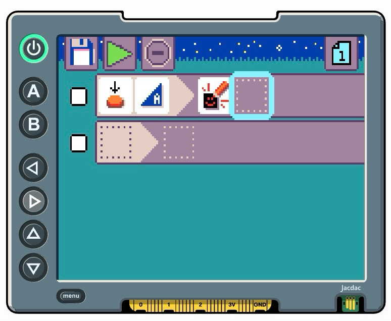
  </Card>
  <Card title="Choose image editor">
    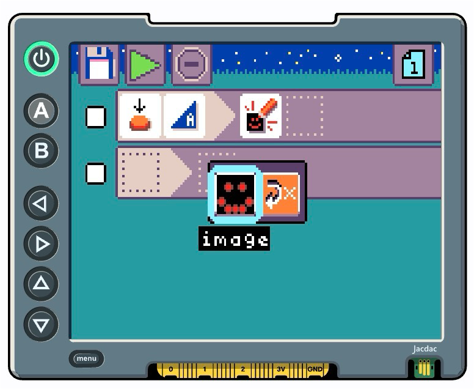
  </Card>
</CardGrid>

## Edit the image

Use the direction pad to move around the 5x5 LED
matrix; press `d-A` to toggle the state of the
LED the cursor is on. When you are finished designing
your image press `d-B` to exit the image editor.

You have finished your first MicroCode When-Do rule!

<CardGrid>
  <Card title="LED image editor">
    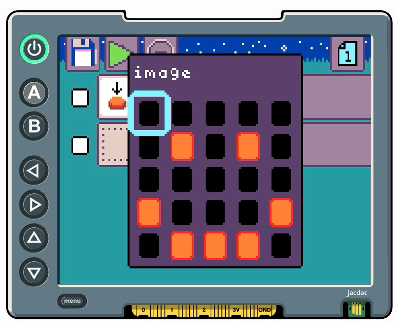
  </Card>
  <Card title="First rule completed!">
    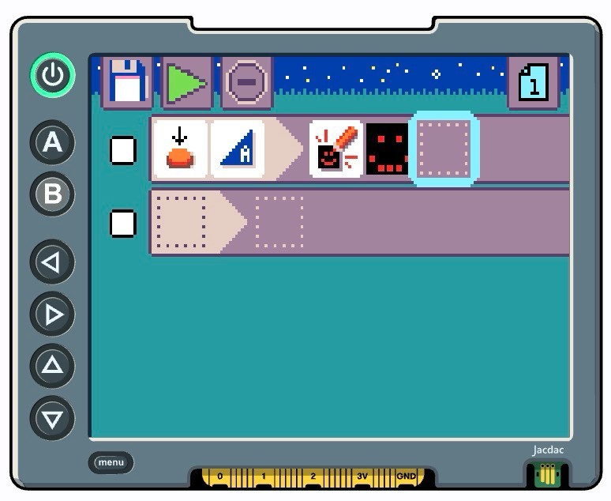
  </Card>
</CardGrid>

## Run your program

You can run the program in one of three ways:

- use the direction pad to navigate to the green play tile and press `d-A`
- press either the `m-A` or `m-B` button on the micro:bit
- press the `menu` button on the display shield

The micro:bit will indicate the program is running by a quick circular
animation on the LED display.

import { Card, CardGrid, LinkCard } from '@astrojs/starlight/components';
