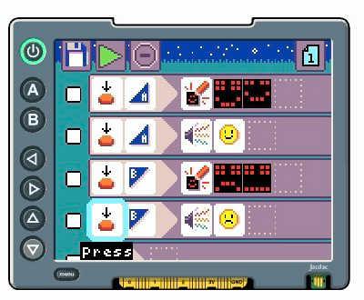

<CardGrid>
  <Card title="Emotion badge program">
    
  </Card>
</CardGrid>

## The emotion badge program

The emotion badge program consists of four **When-Do** rules:

- the **When** section is the left side of the rule and describes an event, such 
  as the pressing of a button.
- the **Do** section is the right side of the rule and describes an action to perform,
  such as displaying a 5x5 LED image on the micro:bit.

The first two rules fire on the press of the m-A button.
The second two rules fire on the press of the m-B button.
The first and third rules display animations of happy and sad faces.
The second and fourth rules play happy and sad sounds.

The first rule reads as: ``When there is press of the m-A button, show two LED images''.

### Running the program

You can run the program in one of three ways:

- use the direction pad to navigate to the green play tile and press `d-A`
- press either the `m-A` or `m-B` button on the micro:bit
- press the `menu` button on the display shield

The micro:bit will indicate the program is running by a quick circular
animation on the LED display.

### Stopping the program

The program will continue to run until

- you move to and select the stop tile (to the right of the play tile), or
- you edit the program

### Running without the display shield

If you remove the micro:bit from the shield and power it via battery or
USB, the last program you edited in MicroCode will begin to run.

### Changing the program

Plugging the micro:bit back into the shield, you can continue to edit
the program (it is saved automatically after each edit operation):

- press the `edit` button on the home page. 
- now navigate to one of the 5x5 LED images and press the d-A button. 
- use the D-pad to navigate around the 5x5 image; 
- press the d-A button to toggle the selected LED on/off; 
- change the image to your liking
- finally, press the d-B button to exit the image editor. 

Now run your modified program! 

Let's do one more edit:

- move the cursor to the empty space after a LED image
- press the d-A button and press it a second time
- edit the image as before and press the d-B button

You have added a new image to the animation sequence.

import { Card, CardGrid, LinkCard } from '@astrojs/starlight/components';