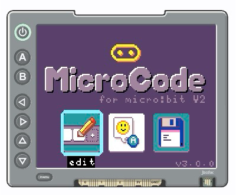

<CardGrid>
  <Card title="MicroCode Home Page">
    
  </Card>
  <Card title="MicroCode Editor">
    
  </Card>
</CardGrid>

## What is MicroCode?

MicroCode provides an intuitive interface for programming your micro:bit with:
- Visual tile-based programming with tooltips
- Immediate execution on the micro:bit
- Three slots for saving programs

## Getting Started

- [Open MicroCode](https://makecode.microbit.org/beta/#pub:67966-39882-94798-31344) in
a web browser. 
- Explore MicroCode via the simulator. Click on the full-screen icon in the simulator to 
  get the best experience. 
- After bringing focus to the display shield simulator, use the arrow 
  keys to navigate, the A key to select and the B key to back up.
- Download the code to your micro:bit by clicking the "Download" button in the MakeCode editor
and follow the instructions on how to copy MicroCode onto your micro:bit.
- [See the display shield instructions](/resources/display-shield-ui)

## Learn More

- [GitHub Repository](https://github.com/microbit-apps/microcode-v2)

import { Card, CardGrid, LinkCard } from '@astrojs/starlight/components';