MicroData was designed with experimentation in mind. The following sections provide experiments you can do with MicroData, but first we want to cover some of the basics.

## Real-time Data view
<CardGrid>
  <Card title="Select Real-time data">
    
  </Card>
  <Card title="Select sensors">
    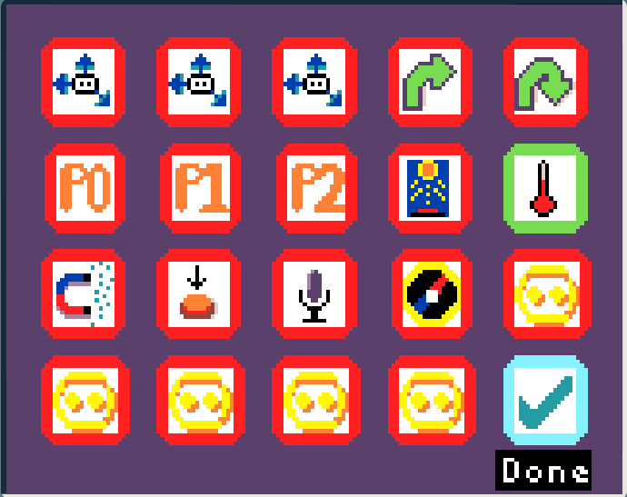
  </Card>
  <Card title="View temperature data in real-time">
    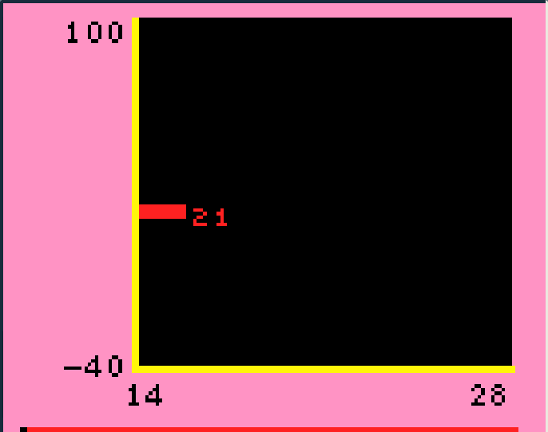
  </Card>
</CardGrid>

Pressing `d-A` selects 'Real-time data' which takes you to the 'Sensor Select' screen.

In the 'Sensor Select' screen tiles you selected are green, and unselected tiles are red. The on-screen tutorial guides you to select up to three sensors to view at a time, when you're done you can Press `d-A` on the 'Done' tile in the bottom-right.

Try touching or breathing on the back of the micro:bit, to see how the temperature graph changes in real-time!

## Logging
You can also setup MicroData to automatically save sensor data into flash storage, meaning it will persit even if you power off the micro:bit.
You can then view this data on device, or upload it to a computer later.

<CardGrid>
  <Card title="Select Log data">
    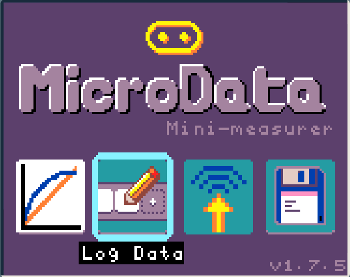
  </Card>
  <Card title="Select sensors">
    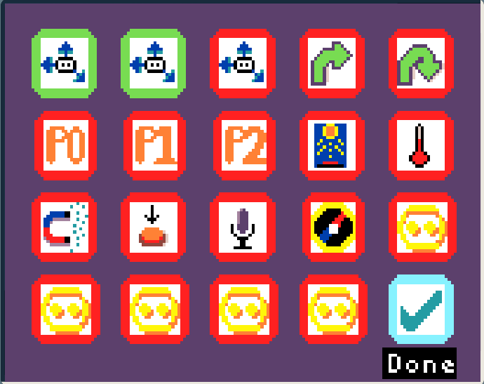
  </Card>
</CardGrid>

You can press `d-A` to select 'log data' which takes you to the 'Sensor Select' screen. This is the same sensor select screen as in the above Real-time data section.

After pressing `d-A` on the 'Done' tile, you will be taken to the logging screen where you can will configure these sensors as you wish for logging.

<CardGrid>
  <Card title="Select a sensor to configure">
    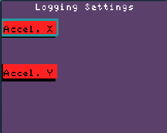
  </Card>
  <Card title="Setup its logging settings">
    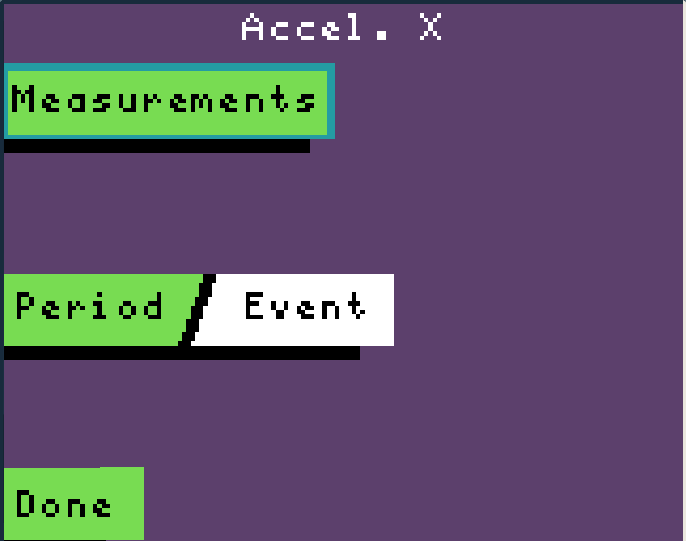
  </Card>
  <Card title="Change how many measurements and/or the logging period">
    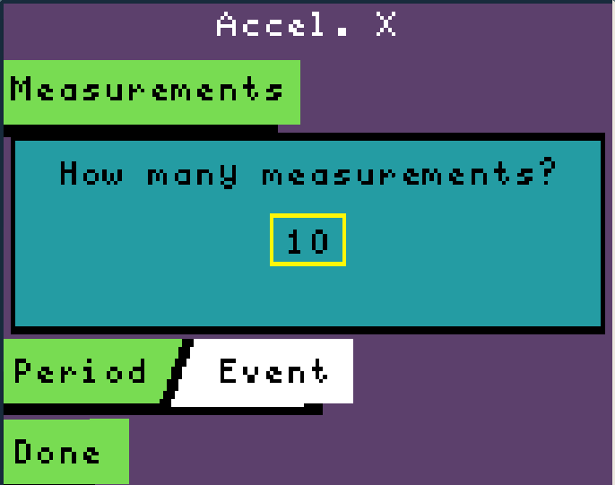
  </Card>
  <Card title="Select Done to finish setup                           ">
    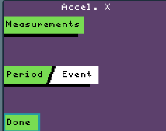
  </Card>
</CardGrid>

Sensors on this screen that are red haven't been configured yet, after confuguring them they turn green.
Pressing `d-A` on one of these sensors takes you to a screen where you can configure the number of measurements and measurement period of the sensor.

You can repeat this for the other sensors you selected,  

<CardGrid>
  <Card title="Repeat with the other sensors you seleted">
    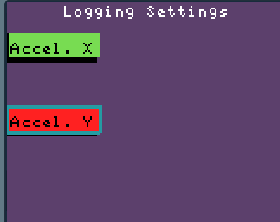
  </Card>
  <Card title="When you're done with the last setup it will start logging">
    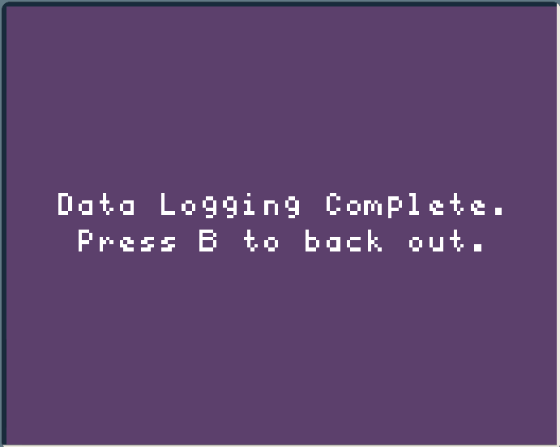
  </Card>
</CardGrid>

You will see logging information for the sensors.

## Viewing your data
After you have logged some data, you can view it on device.

<CardGrid>
  <Card title="View logged data on device">
    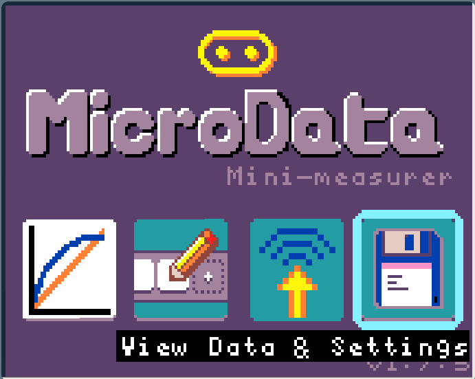
  </Card>
  <Card title="View logged data on device">
    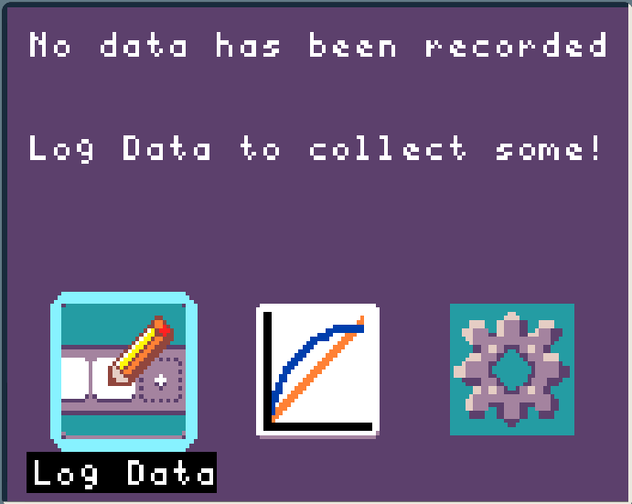
  </Card>
</CardGrid>

In this case the display informs us there is no logged data.

## Experiments
Below you can find a list of experiments you can do with MicroData.
We trialed the following experiments in classrooms and found them to be an engaging way to teach physics and data science to secondary school students:
 - [Finding the magnetometer](../magnetometer_location)
 - [Magnetism and distance](../magnetism_and_distance)
 - [Light, colour and filtering](../light)
 - [Micro:bit drop](../microbit-drop)

import { Card, CardGrid, LinkCard } from '@astrojs/starlight/components';
