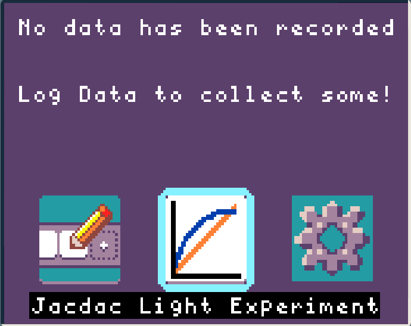
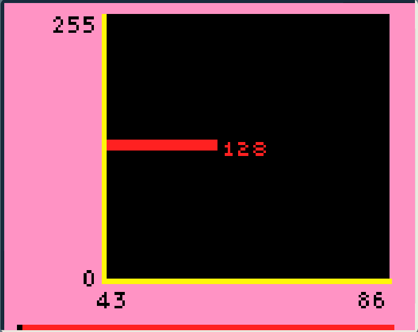
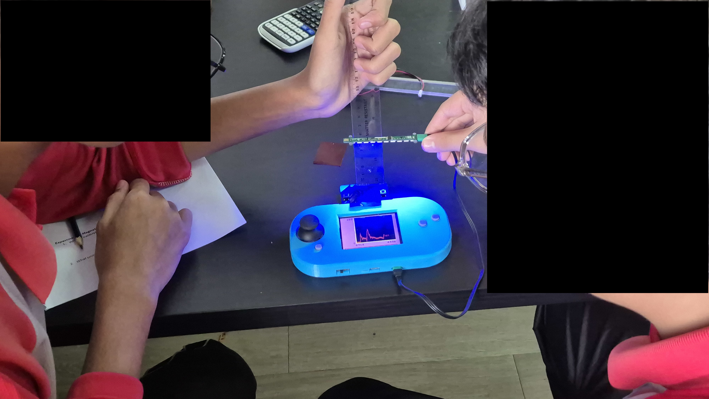
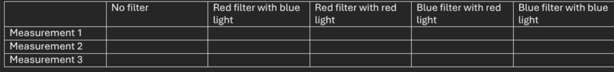

How do filters impact coloured light?

In this experiment we investigate the relationship between
different colours of light and different coloured filters.

We use a [Jacdac light module](https://jacdac.github.io/jacdac-docs/devices/kittenbot/rgbringv10/) as our light source. [Jacdac modules](https://jacdac.github.io/jacdac-docs/) are accessories
that expand the micro:bit's capabilities.

### Equipment
 - micro:bit and display-shield
 - Jacdac light module
 - Blue and red light filters

### Learning overview
 - Scientific variables
 - Mean, Median and Mode
 - Building tables
 - Effect of filters on light

## Experiment setup
<Card title="Select View Data & Settings">
  
</Card>
<Card title="Select Jacdac Light Experiment">
  
</Card>
<Card title="See real-time micro:bit light sensor data">
  
</Card>
<Card title="Hold the Jacdac light sensor 3cm away from the micro:bit's LEDs">
  Use the ruler to hold the Jacdac light module 3cm away. 
  
  
</Card>
<Card title="Complete the table by changing the colour with A/B and changing the light filter">
  Change the light colour by pressing the micro:bit's A and B buttons
  Place the coloured filter on top of the micro:bit's LEDs

</Card>

## Experiment questions
1. Change the light colour by pressing the micro:bit's A and B buttons.

  Place the coloured filter on top of the micro:bit's LEDs then use the light level data to complete this table:
  

2. What was the mean light level when there was no filter?
3. What was the mode light level when there was Red-light + Red-filter?
4. What was the median light level when there was Red-light + Blue-filter?
5. What effect did a Blue-filter have on the Red-light?

import { Card, CardGrid, LinkCard } from '@astrojs/starlight/components';
