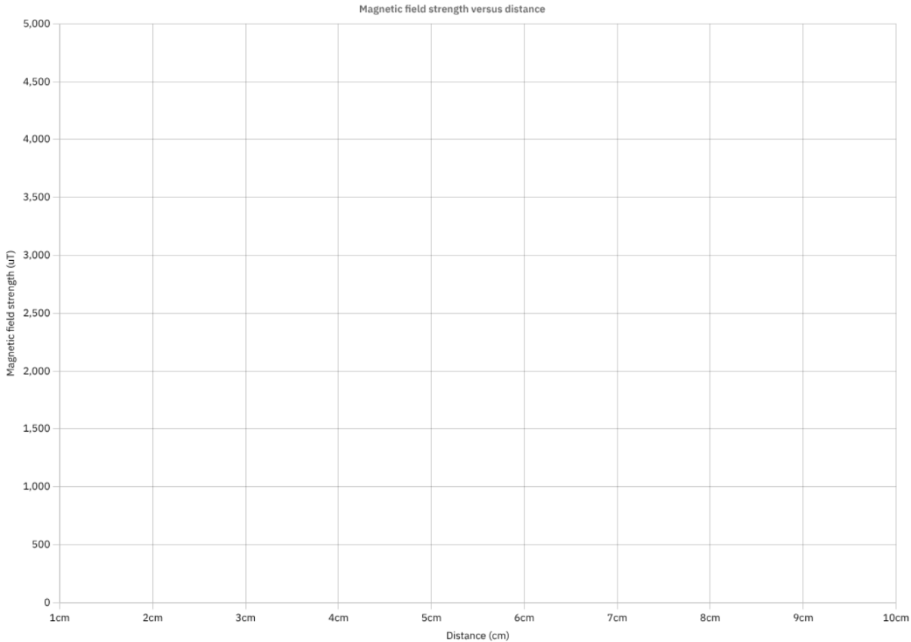

How does the strength of a magnetic field change as a magnet moves further away?

In this experiment we graph distance against magnetic field strength, and use that
to understand proportionality and rates of change.

### Equipment
 - micro:bit and display-shield
 - Any magnet
 - Ruler (15cm+)

### Learning overview
 - How the strength of a magnetic field changes
 - Proportionality and rates of change
 - Graphing
 - Scientific variables

## Experiment setup
<Card title="Select Real-time data">
  
</Card>
<Card title="Select the magnetometer">
  
</Card>
<Card title="Visualise magnetic field strength">
  Use the ruler to place the magnet at fixed distances of 1 to 10cm and measure its magnetic field strength.
  
  
</Card>

## Experiment questions
1. What is the independent variable in this experiment?
2. What is one control variable in this experiment?
3. Complete the distance vs magnetic field strength graph
<Card title="Mangetic field strength vs Distance">
  

  Using the ruler place the magnet at fixed intervals (1cm, 2cm) away from the micro:bit and use MicroData to read its magnetic field strength.
</Card>

4. What was the difference in magnetic field strength between 1cm and 2cm?
5. What was the difference in magnetic field strength between 2cm and 3cm?
6. As distance increases: Is the magnetic field strength changing at a more-than or less-than proportional rate?

import { Card, CardGrid, LinkCard } from '@astrojs/starlight/components';
