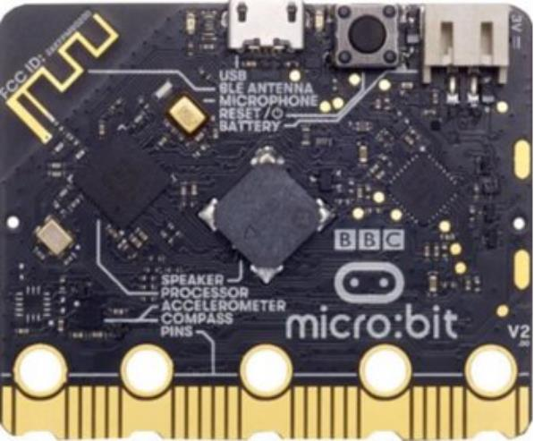
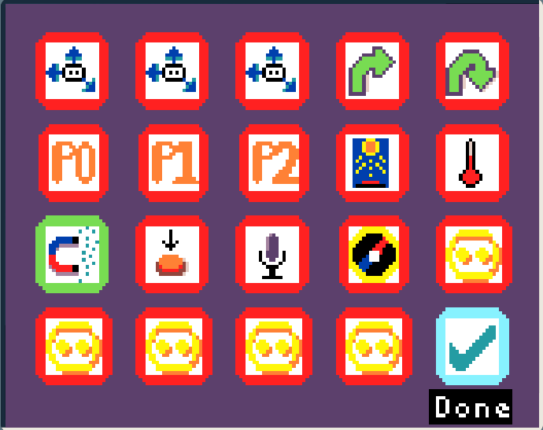
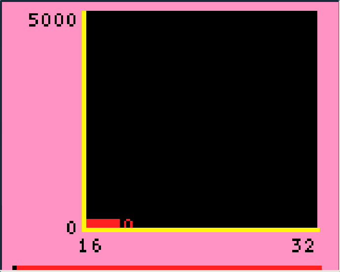

This experiment works as a gentle introduction into MicroData and magnetism. The next two experiments
build on these concepts further. 

The micro:bit has lots of components on the back of it, but which one is the magnetometer?

In this experiment we will try to locate the magnetometer using a magnet and the real-time data viewer.

<CardGrid>
  <Card title="Where is the magnetometer?">
    
  </Card>
</CardGrid>

### Equipment
 - micro:bit and display-shield
 - Any magnet (can be relatively weak)

### Learning overview
 - Basics of magnetism (units, sensor)
 - Critical thinking and reasoning
 - Scientific variables

## Experiment setup
<Card title="Select Real-time data">
  
</Card>
<Card title="Select the magnetometer">
  
</Card>
<Card title="Visualise magnetic field strength">
  Move the magnet around the back of the micro:bit and find where it is strongest.

  Be careful to ensure that the magnets don't touch the micro:bits directly!
  
</Card>

## Experiment questions
  1. Circle where you think the magnetometer is.
  2. Is the magnet strongest when it is pointing directly, or on its side?
  3. What is the dependent variable in this experiment?
  4. What are the units for magnetic field strength?
  5. What was the highest magnetic field strength reading you found?

## Magnetometer location
The magnetometer sensor lives together with the accelerometer. Look at the back of the micro:bit again to see where the accelerometer is.

<CardGrid>
  <Card title="Micro:bit components">
    
  </Card>
</CardGrid>

1. Where did you find the magnetometer reading to be the highest?
2. You may notice high magnetic field level readings around other components that aren't the magnetometer. Why might this be?

One area that has a significant spike in magnetic field reading, but isn't the magnetometer is the speaker.
Why might a speaker interacting with a magnet cause the magnetometer to have significant readings?

import { Card, CardGrid, LinkCard } from '@astrojs/starlight/components';
