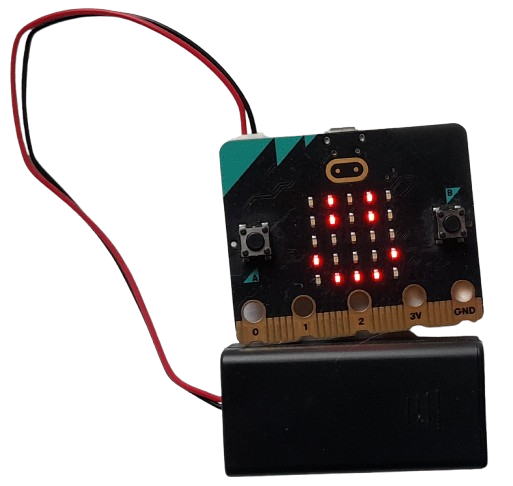
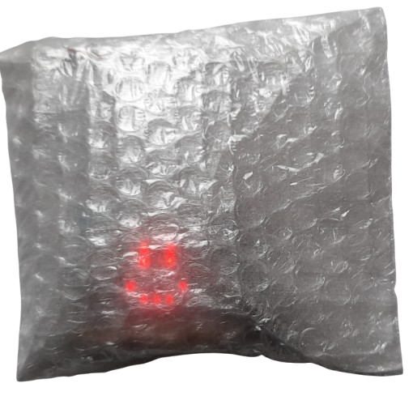
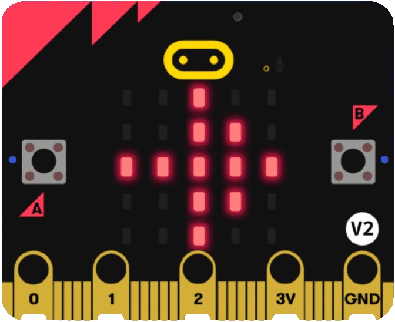
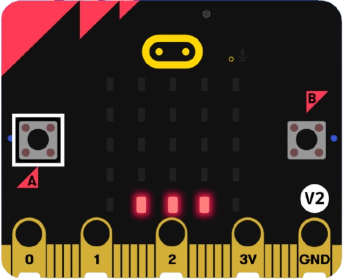
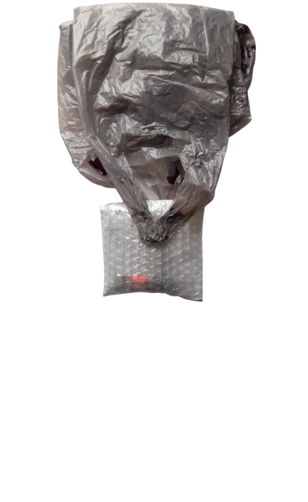
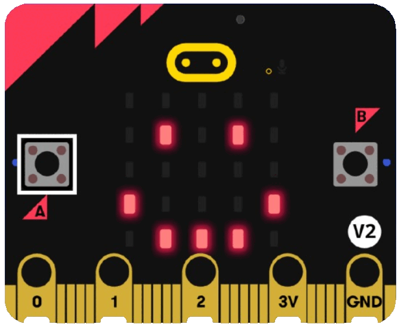
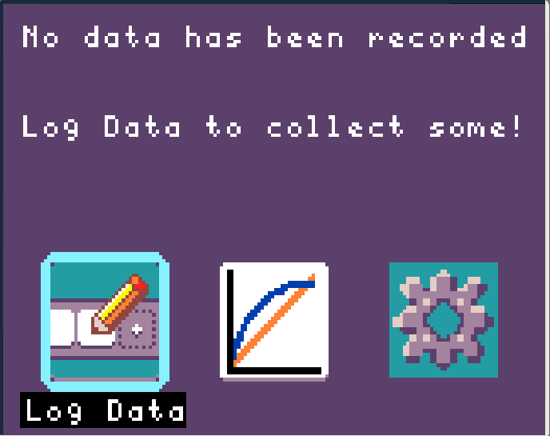

---
title: Micro:bit drop
description: Measure the magnetic force from an electro-magnet
---

How can we use household materials to keep our micro:bit safe when we drop it,
and can we calculate force on impact using micro:bit acceleration?

<CardGrid>
  <Card title="Get your micro:bit + battery pack">
    
  </Card>
  <Card title="Protect it the best you can">
    
  </Card>
</CardGrid>

### Equipment
 - micro:bit + battery pack
 - Packaging materials to build with
 - Either a display-shield or laptop to view the acceleration data with later

### Learning overview
 - Teamwork and collaboration
 - Calculating force from acceleration
 - Design & Technology

## Experiment setup
For this experiment we are logging data whilst the micro:bit is disconnected from the
display-shield.

We will make the micro:bit log its acceleration data when its disconnected, then connect the 
display-shield again later in order to calculate impact force.

It's important that the design you build keeps the A button pressable and the LEDs visible,
because this is how we start logging on the micro:bit.

<Card title="Logging data in detached mode">
  When there's no display-shield connected, you can press A to start logging the sensor
  indicated by the symbols on the micro:bit LEDs, or press B to go to the next option.

  These 3 symbols all represent the accelerometer option. When we're ready to drop we will
  press A.

  For now, make sure you can see these 3 symbols, if not press B a few times:
  
</Card>
<Card title="Build around your micro:bit to keep it safe">
  Make sure you can press the A button and see the micro:bit LEDs!
  
</Card>
<Card title="Start logging">
  When you're ready to drop press A on the micro:bit, you will see three dots appear.
  This means the micro:bit is recording:
  
</Card>
<Card title="Drop the micro:bit from 30cm">
  When you're ready to drop press A on the micro:bit, you will see three dots appear.
  This means the micro:bit is recording:
  
</Card>
<Card title="Stop recording after landing">
  Press A again to stop the recording, the ... will turn into a smiley-face
  
</Card>
<Card title="View accelerometer data">
  
</Card>

## Experiment questions
  1. What is the equation for force?.
  2. What are the two units for force?
  3. If an object weighs 20g and has an acceleration on impact of 10mg (0.01g), what is the force on impact?
  4. What is the dependent variable in this experiment?
  5. What was the highest or lowest acceleration value in your data?
  6. Assuming the answer above is your acceleration on impact, and the mass of the micro:bit + battery pack is 80g: what was the impact force?

import { Card, CardGrid, LinkCard } from '@astrojs/starlight/components';
