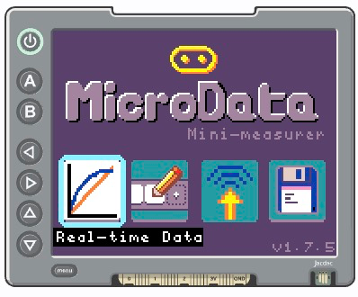
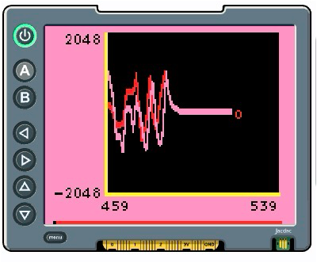

<CardGrid>
  <Card title="MicroData Home page">
    
  </Card>
  <Card title="MicroData Real-time data view">
    
  </Card>
</CardGrid>

MicroData is a comprehensive data collection and analysis platform designed for the BBC micro:bit v2.

## What is MicroData?

MicroData provides tools for collecting, visualizing, and analyzing sensor data from your micro:bit with:

- Real-time data streaming and visualization
- Multi-sensor support
- Data analysis capabilities

MicroData makes it easy to collect data using micro:bit and Jacdac sensors, then visualise that data on a display-shield.
This means you can conduct experiments and learn data science portably without the need for a conventional computer.

## Sensors supported

MicroData supports all of the micro:bit's built-in sensors, plus 5 Jacdac sensors. You can sense up to three sensors at the time, the supported sensors are as follows:
- Buttons
- Accelerometer
- Magnetometer
- Light sensor
- Touch sensor
- Microphone
- Voltage sensing
- Temperature
- Jacdac Temperature
- Jacdac Flex
- Jacdac Distance
- Jacdac Soil moisture
- Jacdac Light

Jacdac sensors expand the sensing capabilities of the micro:bit, allowing you to capture more specialised and accurate data.

## Getting Started
We recommend following the [MicroData guide](/docs/microdata/guide/) to get familiar with MicroData's features and capabilities.
You can do this with a physical micro:bit and display-shield, or try it out in the simulator.

### Setting up the simulator
- [Open MicroData in MakeCode](https://makecode.microbit.org/beta/#pub:95125-24885-94306-07135).
- Explore MicroData via the simulator. Click on the full-screen icon in the simulator to 
get the best experience.
- After bringing focus to the display shield simulator, use the arrow 
keys to navigate, the A key to select and the B key to back up.
- Download the code to your micro:bit by clicking the "Download" button in the MakeCode editor
and following instructions on how to copy MicroData onto your micro:bit.
- [See the display shield instructions](/resources/display-shield-ui)

## Experiments
Below you can find a list of experiments you can do with MicroData.
We trialed the following experiments in classrooms and found them to be an engaging way to teach physics and data science to secondary school students:
 - [Finding the magnetometer](./magnetometer_location)
 - [Magnetism and distance](./magnetism_and_distance.mdx)
 - [Light, colour and filtering](./light.mdx)
 - [Micro:bit drop](./microbit-drop.mdx)

Each experiment covers learning objectives, resources, requirements and questions for the students to answer.

## Learn More

- [GitHub Repository](https://github.com/microbit-apps/microdata)

import { Card, CardGrid, LinkCard } from '@astrojs/starlight/components';
